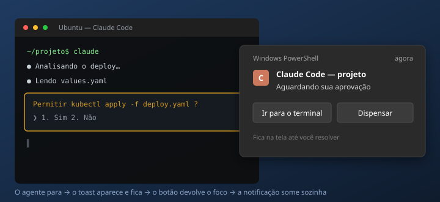

# 🔔 wsl-claude-notify

Notificação do Windows quando o [Claude Code](https://claude.com/claude-code)
rodando no WSL2 para e fica esperando sua aprovação.

Ela **fica na tela até você resolver** — não some em 5 segundos — tem um botão que
traz seu terminal de volta, e **some sozinha** quando você volta pro terminal.



## Por que

Com o Claude Code rodando no WSL, você tira o olho do terminal e ele fica parado
esperando um "sim". Às vezes por meia hora. O toast padrão do Windows some rápido
demais e não resolve.

Aqui o toast usa `scenario="reminder"`: fica na tela e na central de notificações
até ser resolvido. E a mensagem diz **onde** ele parou — nome do projeto, sessão
do tmux ou workspace do [herdr](https://herdr.dev) — porque com vários agentes
rodando "o Claude precisa de permissão" sozinho não ajuda.

## Como usar

Precisa de `jq` no WSL e de uma senha de administrador **uma vez** (explicado abaixo).

```bash
git clone https://github.com/omatheusgit/wsl-claude-notify.git
cd wsl-claude-notify && ./install.sh
```

Reinicie o Claude Code e teste:

```bash
~/.claude/hooks/notify-windows.sh "Teste" "Clique em Ir para o terminal"
```

### O botão "Ir para o terminal"

Por padrão ele ativa a janela do Windows Terminal direto, sem depender de mais
nada. Outras opções:

```bash
./install.sh --process WezTerm       # focar outro terminal
./install.sh --hotkey Ctrl+Alt+F8    # disparar um atalho seu
./install.sh --uninstall             # remover tudo
```

## Bônus: os botões do mouse

Tem uma segunda metade neste repo, em [`mouse/`](mouse/): um script de AutoHotkey
que transforma os **botões extras de um Redragon Storm Pro** em ícones de taskbar
— `Ctrl+Alt+F9` alterna o Windows Terminal, `F10` o Teams, `F11` o Claude Desktop.

É independente da notificação, mas combina: se você instalar os dois, aponte o
botão do toast para o atalho `Ctrl+Alt+F8`, que o script expõe justamente para
isso (sempre foca, nunca minimiza):

```bash
./install.sh --hotkey Ctrl+Alt+F8
```

```powershell
cd mouse; .\install-mouse.ps1
```

## O que o install faz

| Passo | Onde |
|---|---|
| Copia 4 hooks | `~/.claude/hooks/` |
| Registra os hooks (sem apagar o que já existe, com backup) | `~/.claude/settings.json` |
| Escreve o script que devolve o foco | `%LOCALAPPDATA%\claudefocus.vbs` |
| Registra o protocolo `claudefocus:` — **pede UAC** | `HKLM\Software\Classes` |

Os hooks:

- **`Notification`** → dispara o toast. É o sinal oficial do Claude Code de que
  o modelo está pedindo permissão.
- **`PostToolUse`** e **`UserPromptSubmit`** → limpam o toast quando você aprova
  ou digita algo novo.
- Um **watcher** em segundo plano limpa quando o Windows Terminal ganha foco,
  para o caso de você voltar por atalho sem clicar na notificação.

## Detalhes que custaram caro

Se você for adaptar isso, estes quatro pontos são onde eu perdi tempo:

**O toast não lê o `HKCU`.** Um protocolo registrado em
`HKCU\Software\Classes` funciona com `Start-Process` e falha no clique do toast,
com o diálogo "Obter um aplicativo para abrir este link". Tem que ser `HKLM` —
daí o UAC.

**`wt.exe` não pode ser lançado pelo toast.** Ele é um *app execution alias*:
0 byte, um ReparsePoint em `WindowsApps`. O PowerShell resolve, o contexto de
ativação do toast não. `cmd.exe /c start wt.exe` também não salva.

**`wscript.exe` em vez de `powershell.exe`.** O PowerShell pisca uma janela preta
mesmo com `-WindowStyle Hidden`. O `wscript.exe` roda o VBScript sem janela
nenhuma e é um binário real em `System32`.

**O VBScript quebra com BOM.** `Set-Content -Encoding UTF8` do PowerShell escreve
BOM e o VBScript morre com "caractere inválido" na linha 1. Tem que ser
`[System.IO.File]::WriteAllText` com `UTF8Encoding $false`.

## Ajustes

Variáveis de ambiente, no `~/.bashrc`:

```bash
export CLAUDE_TOAST_GRACE=4        # segundos antes do watcher começar a olhar o foco
export CLAUDE_TOAST_TIMEOUT_MIN=20 # depois disso o watcher desiste
```

A carência existe porque, sem ela, se você já estiver no terminal o toast sumiria
antes de você ouvir o som.

## Limitação conhecida

O watcher olha o **processo** em foco, não a aba. Se você estiver no Windows
Terminal numa aba de outro projeto, a notificação some mesmo assim.

## Licença

MIT
